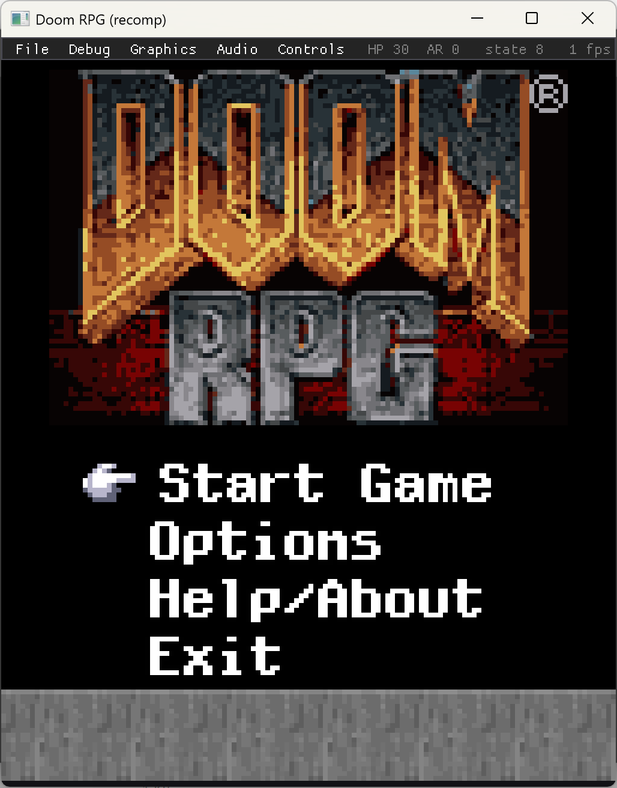

# doomrpgrecomp

**Static recompilation of _Doom RPG_ (2005, J2ME) into a native Windows executable.**

```
  ▓█████▄  ▒█████   ▒█████   ███▄ ▄███▓    ██▀███   ██▓███    ▄████
  ▒██▀ ██▌▒██▒  ██▒▒██▒  ██▒▓██▒▀█▀ ██▒   ▓██ ▒ ██▒▓██░  ██▒ ██▒ ▀█▒
  ░██   █▌▒██░  ██▒▒██░  ██▒▓██    ▓██░   ▓██ ░▄█ ▒▓██░ ██▓▒▒██░▄▄▄░
  ░▓█▄   ▌▒██   ██░▒██   ██░▒██    ▒██    ▒██▀▀█▄  ▒██▄█▓▒ ▒░▓█  ██▓
  ░▒████▓ ░ ████▓▒░░ ████▓▒░▒██▒   ░██▒   ░██▓ ▒██▒▒██▒ ░  ░░▒▓███▀▒
   ▒▒▓  ▒ ░ ▒░▒░▒░ ░ ▒░▒░▒░ ░ ▒░   ░  ░   ░ ▒▓ ░▒▓░▒▓▒░ ░  ░ ░▒   ▒
   ░ ▒  ▒   ░ ▒ ▒░   ░ ▒ ▒░ ░  ░      ░     ░▒ ░ ▒░░▒ ░       ░   ░
   ░ ░  ░ ░ ░ ░ ▒  ░ ░ ░ ▒  ░      ░        ░░   ░ ░░       ░ ░   ░
     ░        ░ ░      ░ ░         ░         ░                    ░
   ░                                               r e c o m p
```

> Some demons clawed their way out of Phobos. This one clawed its way out of a
> **128×128, 12-button Java phone from 2005** and onto your 4K monitor — without
> an emulator, without a JVM, without `java.exe` anywhere in sight.
>
> We took 26 obfuscated `.class` files (every field is named `a`, naturally),
> turned the JVM bytecode into C, hand-built the slice of J2ME that the game
> actually touches, and compiled the whole thing into one standalone `.exe`.
> The recompiled C **is** the game. There is no VM underneath. It's demons all
> the way down.



> *The recompiled game booted to its main menu, with our Dear ImGui dev bar
> (File · Debug · Graphics · Audio · Controls) docked above the 128×128 view.*

---

## Wait, you can "recomp" a Java game?

Yep. The `recomp` family (N64Recomp, gbarecomp, psxrecomp…) takes a binary for a
dead machine and rewrites it as portable C. _Doom RPG_'s "machine" just happens
to be the **Java Virtual Machine** instead of an ARM7 or a MIPS R3000. The JVM is
a stack machine with a tidy, fully-documented instruction set and self-describing
class files — which, frankly, makes it a _friendlier_ recomp target than a pile of
raw ARM with no symbols.

```
┌──────────────┐   ┌───────────────┐   ┌──────────────┐   ┌──────────────┐
│  DoomRPG.jar  │──▶│  Parse .class  │──▶│  Bytecode→C   │──▶│  C source     │
│ 26 classes +  │   │  (const pool,  │   │  per-method   │   │  (.c/.h, one  │
│ BSP/MIDI/PNG  │   │  fields, code) │   │  stack→SSA-ish│   │  file/class)  │
└──────────────┘   └───────────────┘   └──────────────┘   └──────┬───────┘
                                                                  │
        ┌──────────────┐   ┌─────────────┐   ┌──────────────┐    │
        │  DoomRPG.exe  │◀──│  MSVC + SDL2 │◀──│ J2ME runtime  │◀───┘
        │  standalone   │   │   CMake       │   │ (handwritten) │
        └──────────────┘   └─────────────┘   └──────────────┘
```

1. **Parse** — read each `.class`: constant pool, fields, methods, `Code`
   attributes. Java overloads fields by _descriptor_ (six different `a`s in one
   class), so every symbol is keyed by `(owner, name, descriptor)`, never name.
2. **Translate** — each method's stack-based bytecode becomes straight-line C
   operating on an explicit operand-stack model, with `goto` labels for every
   branch target. Types come from descriptors; no guessing.
3. **Runtime** — a hand-written, native sliver of MIDP-2.0 / CLDC-1.0: just the
   classes the game references (see the table below). `Graphics`/`Canvas` blit to
   an SDL2 framebuffer, `RecordStore` saves go to a file, `Player` plays the
   embedded `.mid`s through Windows MIDI.
4. **Compile** — MSVC turns the generated C + runtime into one `.exe`. SDL2 is
   the only runtime dependency.

## The J2ME surface we have to fake

Doom RPG only touches this much of the platform — the entire runtime contract,
enumerated from the constant pools of all 26 classes:

| Package | Classes used |
|---|---|
| `java.lang` | Object, String, StringBuffer, Integer, Long, Math, System, Class, Runnable, Thread, Runtime, Throwable + 5 exceptions |
| `java.io` | (Byte)Array{In,Out}putStream, Data{Input,Output}Stream, DataInput, In/OutputStream, PrintStream, IOException |
| `java.util` | Random, Vector |
| `lcdui` | Alert, AlertType, Canvas, Display, Displayable, **Graphics**, **Image**, **game.GameCanvas** |
| `media` | Manager, Player, Control, Controllable, control.VolumeControl |
| `midlet` | MIDlet, MIDletStateChangeException |
| `rms` | RecordStore, RecordComparator, RecordEnumeration, RecordFilter |

That's it. No reflection, no classloaders, no `synchronized` gymnastics worth
worrying about. CLDC **1.0** even means _no floating point_ — the renderer is
all fixed-point integer math (there's a `sintable.bin` in the JAR to prove it).

## Status

**Playable.** It recompiles all 383 methods, boots from a cold start through the
intro and menus into the textured 3D dungeon, and walks around — no JVM, no
emulator. Combat and deeper systems are the current frontier.

| Component | Status |
|---|---|
| `.class` parser (const pool / fields / methods / code) | ✅ all 26 classes |
| Bytecode → C translator | ✅ 383/383 methods → C, **compiles clean** (MSVC) |
| J2ME runtime (lang / io / util / lcdui / media / rms) | ✅ all 129 methods implemented |
| Links to a native `DoomRPG.exe` | ✅ zero unresolved symbols |
| SDL2 display + input | ✅ integer-scaled window, keyboard |
| Windows MIDI playback | ✅ via MCI (real General MIDI) |
| **Launches + runs the game loop** | ✅ boots, no crashes, loop alive |
| PNG decode (own inflate, no zlib) | ✅ verified pixel-exact vs reference |
| **Renders the intro** | ✅ copyright → JAMDAT → Fountainhead splashes |
| **Boots to main menu** | ✅ sound prompt → Start Game / Options / Help / Exit |
| **Menu input works** | ✅ d-pad/fire navigate; New Game → the Mars briefing |
| **In-game (3D dungeon)** | ✅ briefing → approach cinematic → textured 3D view + HUD |
| **Movement / turning** | ✅ d-pad turns and walks the first-person view |
| **Dev / cheat menu (ImGui)** | ✅ File·Debug·Graphics·Audio·Controls bar over the game |
| Playable | 🔨 renders + moves; combat / items / maps still to exercise |

### Dev / cheat menu

A Dear ImGui bar docks across the top of the window with the game viewport
below it — shippable as a player cheat/options menu. Because the recomp turns
every game variable into a native C global, the menu pokes the real game state
directly:

- **File** — New Game, plus 9 emulator-style **save states** (full snapshot of
  the bump-arena heap + every static global; restore is a memcpy).
- **Debug** — Godmode / infinite ammo / give HP·armor·ammo, **level warp** (any
  `.bsp`), **state jump**, and the game's built-in debug counters.
- **Graphics** — window scale, nearest/linear filter, scanline overlay.
- **Audio** — master volume + mute (Windows audio session) and music (MCI).
- **Controls** — rebindable **keyboard + Xbox controller** (left stick drives
  the d-pad), persisted to `controls.cfg`.

See [`docs/`](docs/) for the running design notes and the bug ledger (every
recomp accrues a glorious list of "found-and-fixed" war stories — ours starts
here).

## Quick start

Requires **Visual Studio 2022**, **Python 3**, and **SDL2 + Dear ImGui** via
[vcpkg](https://github.com/microsoft/vcpkg) (`vcpkg install sdl2 imgui`).

```powershell
# 0. Bring your own legally-obtained DoomRPG.jar
copy path\to\DoomRPG.jar game\

# 1. Recompile bytecode -> C, build the native exe, stage assets + SDL2.dll
.\build.ps1            # add -Run to launch it, -VcpkgRoot <path> if not C:\vcpkg

# 2. Raise hell  (finds game\extracted automatically)
build\DoomRPG.exe
```

`build.ps1` extracts the JAR, runs the recompiler (`tools\recompiler\jrecomp.py`),
generates the save-state registry, compiles the generated C + handwritten runtime
with MSVC, and links one standalone `DoomRPG.exe`.

## Standing on the shoulders of giants

- **[N64Recomp](https://github.com/N64Recomp/N64Recomp)** — proved static recompilation of whole games is practical.
- **gbarecomp / psxrecomp** — the sibling projects this one cribs its structure from.
- **The JVM Spec, Ch. 4 & 6** — the `.class` format and the opcode table, free and exhaustive.
- **[DoomRPG-RE](https://github.com/Erick194/DoomRPG-RE) by Erick194** — a clean C
  reverse-engineering of Doom RPG. We used it purely as a *reference* to decode our
  obfuscated symbols (the player-stat layout behind the cheat menu, the save-store
  names) — **no code was copied** (it's GPL-3.0; this project is MIT). Cross-checking
  its v0.2.1→v0.2.2 fixes against our output also confirmed our J2ME recomp doesn't
  share its BREW-version bugs (e.g. `aiGoal_MOVE` is already correct here).
- **id Software & Fountainhead** — for making a genuinely great little dungeon crawler out of 300KB of bytecode.

## Legal

This repository contains **no** copyrighted game data — no JAR, no bytecode, no
art, no levels. The tooling and runtime are MIT-licensed (see `LICENSE`). _Doom
RPG_ is © id Software / Electronic Arts. Supply your own legally-obtained copy.

---

*Built with Claude Code. The recompiled C is the game — no JVM underneath.*
